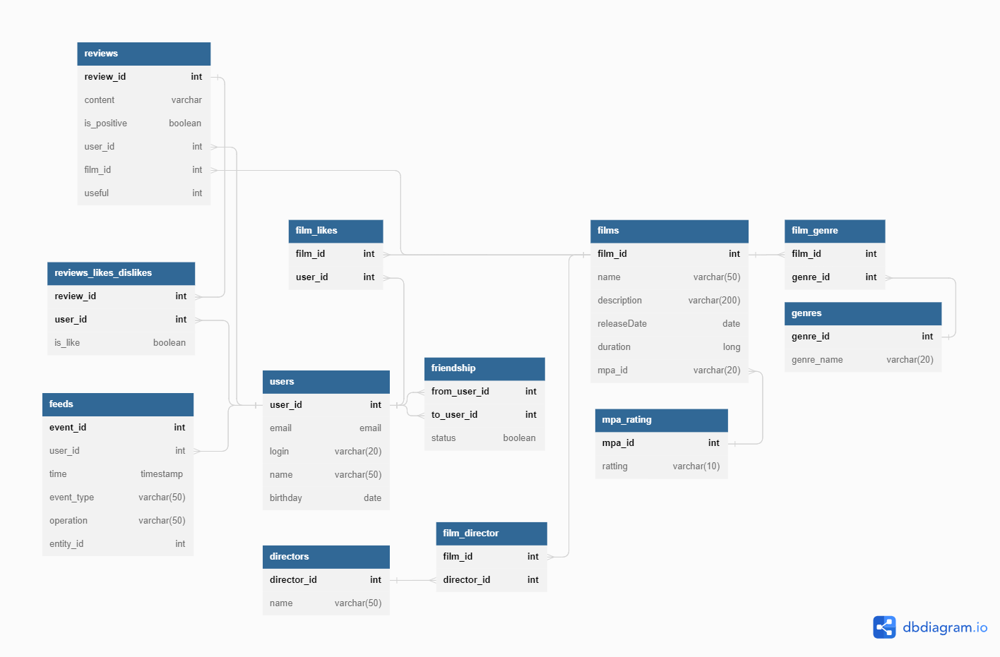

# Схема базы данных
## ER-диаграмма


## Примеры SQL запросов
### Добавление пользователя:
```sql
INSERT INTO users (email, login, name, birthday)
VALUES ("yandex@yandex.ru", "yandex", "ya", "1999-02-23");
```

### Обновление пользователя:
```sql
UPDATE users SET name = "yandex"
WHERE user_id = 2;
```

### Добавления в друзья:
```sql
INSERT INTO friendship(from_user_id, to_user_id, status)
VALUES (1, 2, TRUE);
```

### Получение друзей пользователя:
```sql
SELECT *
FROM users AS u
LEFT JOIN friendship AS f ON u.user_id = f.from_user_id
WHERE f.to_user_id = 2;
```

### Добавление фильма:
```sql
INSERT INTO film (name, description, release_date, duration, mpa_id)
VALUES ('Back to the future', 'Good film', '1997-01-20', 6060, 1);
```

### Получение списка жанров:
```sql
SELECT *
FROM genres
```